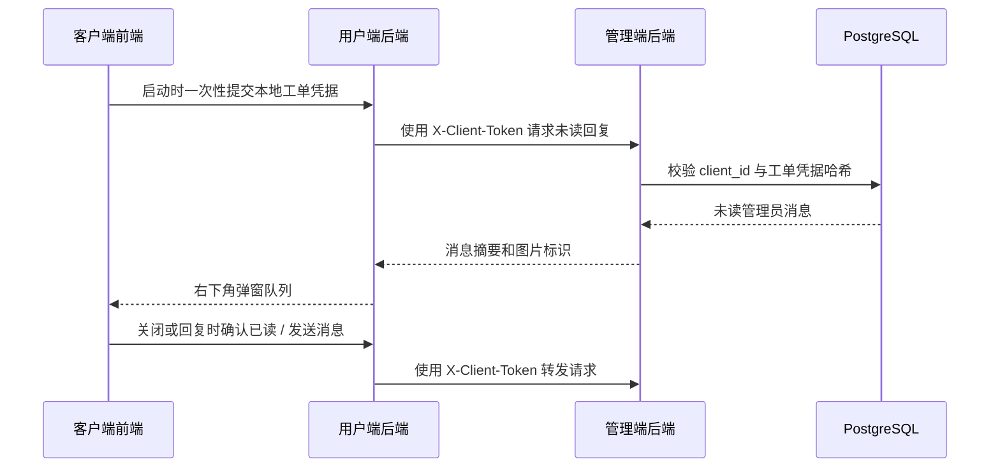

# 反馈会话与启动时回复提示设计

## 目标

将单向反馈升级为双向会话。管理端可按指定 `client_id` 向对应工单发送文字和图片；客户端仅在每次应用启动时检查一次未读管理员回复，并在右下角依次弹出。用户可关闭或进入会话继续回复，并可上传图片。

## 已确认约束

- 不使用定时轮询。
- 不使用 SSE、WebSocket 或任何实时推送。
- 客户端已打开期间的新管理回复，留待下次启动显示。
- 每个应用实例只执行一次未读收件箱查询；关闭弹窗、打开设置、切换前台均不重新查询。
- 管理员和客户端的单条消息最多上传 5 张图片，每张不超过 10MB。
- 历史反馈不回投客户端：它们没有客户端持有的访问凭据，只作为管理历史保存。

## 架构

现有 `feedback` 保留为工单主体，保存原始反馈、`client_id`、进度与工单访问凭据哈希。新增 `feedback_messages` 存储双向消息、图片和已读状态。浏览器通过用户端后端的 `adminhub` 代理访问管理端，浏览器不持有 `X-Client-Token`。

## 数据与权限

### feedback 新字段

- `client_access_token_hash`：新反馈创建时生成的随机工单凭据的 SHA-256 哈希。历史记录为 `NULL`。
- `client_access_enabled`：新反馈为 `true`，历史记录为 `false`。管理端据此标识不可回投的历史工单。

明文凭据只在新反馈创建响应中返回一次，由客户端保存到本机 `localStorage`。数据库、日志和 URL 均不得保存明文。

### feedback_messages 新表

- `id`：自增主键。
- `feedback_id`：关联 `feedback.id`。
- `sender_type`：仅允许 `client` 或 `admin`。
- `content`：客户端正文或管理员简体中文回退正文；允许为空以支持纯图片消息。
- `content_i18n_json`：管理员可选的 `zh-CN`、`en`、`zh-TW` 正文。
- `image_paths_json`：相对文件路径数组。
- `created_at`、`client_read_at`、`admin_read_at`：创建和双方已读时间。

按 `feedback_id + created_at` 与 `feedback_id + client_read_at` 建索引。图片写入 `feedback-messages/<feedback_id>/<message_id>/`，只保存安全相对路径。

### 强制安全边界

- 裸 `client_id` 不能作为读取、确认已读、回复或下载图片的唯一凭据。
- 客户端请求必须同时校验 `client_id`、`feedback_id` 与工单访问凭据；凭据哈希使用常量时间比较。
- 管理端接口使用管理员 JWT；用户端后端到管理端使用 `X-Client-Token`。
- 客户端图片以 POST Blob 代理读取，访问凭据不出现在图片 URL。
- 图片仅接受 JPEG、PNG、WEBP、GIF，服务端解码验证真实内容并限制数量与大小。任一附件失败时不创建消息，也不遗留文件。
- 客户端不允许访问现有仅管理员授权的 `/api/admin/files/*`。

## 接口

### 管理端 JWT 接口

- `GET /api/admin/feedback/{feedback_id}/messages`：读取完整会话，并标记客户端消息为管理员已读。
- `POST /api/admin/feedback/{feedback_id}/messages`：接收三语正文与图片，创建管理员消息。
- 现有 `PUT /api/admin/feedback/{feedback_id}` 保持只更新工单进度。

### 管理端客户端令牌接口

- `POST /api/client/feedback/inbox`：接收 `client_id` 和本机持有的 `{ feedback_id, access_token }` 列表，仅返回验证通过的未读管理员消息。
- `POST /api/client/feedback/{feedback_id}/messages`：创建客户端文字/图片回复。
- `POST /api/client/feedback/{feedback_id}/messages/{message_id}/read`：写入管理员消息的 `client_read_at`。
- `POST /api/client/feedback/attachment`：验证工单凭据后返回会话图片。

### 用户端 adminhub 代理接口

- `POST /api/adminhub/feedback`：原反馈提交接口，响应增加 `feedback_id` 与一次性 `access_token`。
- `POST /api/adminhub/feedback/inbox`：转发启动时收件箱请求。
- `POST /api/adminhub/feedback/{feedback_id}/messages`：转发客户端文字/图片回复。
- `POST /api/adminhub/feedback/{feedback_id}/messages/{message_id}/read`：转发已读确认。
- `POST /api/adminhub/feedback/attachment`：以 Blob 形式代理受保护图片。

## 客户端行为

- 创建新反馈成功后保存工单 ID 与凭据。
- 应用启动完成后读取本机凭据并调用一次收件箱接口。
- 多条未读管理员消息按创建时间排队，一张右下角弹窗只表示一条消息。
- 点击“关闭”或“回复”均确认该消息已读；回复进入同一工单会话，并可发送文字、图片或纯图片。
- 成功发送回复后仅本地追加该消息，不刷新收件箱。
- 管理员文本按当前语言、简体中文、任意可用译文的顺序回退；客户端消息原样显示。

## 上线与验收

- 新表由 `Base.metadata.create_all` 创建；旧 `feedback` 的两个新列由幂等启动迁移添加。
- 不向历史反馈补发访问凭据，不允许按裸 `client_id` 查询其回复。
- 分别推送 `ConvertAPK-Desktop` 与 `ConvertAPK-Admin`；线上先备份涉及文件，再更新两个检出目录，最后只重建 `backend`、`frontend`、`admin-backend` 与 `admin-frontend`。
- 验收：无轮询和实时通道；无未读不弹窗；关闭后不重复；回复可带图；错误凭据、错误 clientId、错误工单和错误图片标识均被拒绝且不泄露附件。
